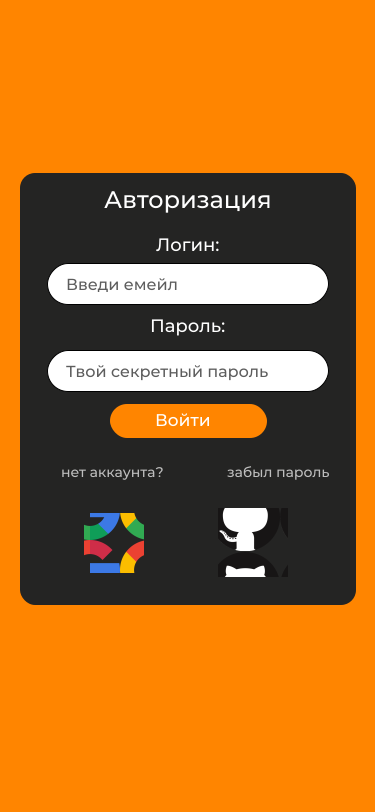
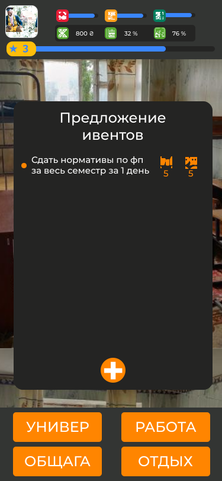
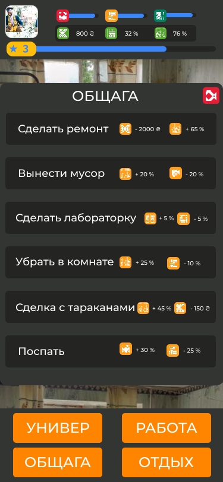

# kpi_student

The game brings us to the beginning of student life. You will start as a simple student with not a big amount of money in the new city, that is not ready for new visitors.
Game contains:

- logical puzzles
- strategic elements
- puzzled plot
- not definitely solutions
- fortune
- a bit of mystery
- a lot of studies
- and much more

Could you survive all it's challenges? The KPI and his hostels are waiting for you.

_weekly you will be fighting with boss_

### Features and Requests

#### Our game is _**not** planned_ with **hardcoded** plot. Everyone can change it with the submission of plot fragment via our in-game submitting form.

In this project, a game will have those features:

1. The user must log in to start the game in one of the following ways:
   - Mail
   - Google account
   - Github account

_login form_

2. If the user has forgotten his password, he will be able to restore it at the next authorization attempt
3. The user will be able to monitor and pump his character within the categories of actions presented in the game, namely, train him, monitor his health, finances
4. The user will be able to log in on any device that supports the browser and then continue the game with the saved progress
5. The game contains events. Events will affect the game progress, depending on the user decision and the state of the character. The episode will occur as the character develops and depending on the playing time
6. Each user will be able to offer his event, which will have to go through the approval stage by other users to add to the game
7. In the game, realized inside the game currency, which the user can spend on the development of his character and passing events
8. The game has a scale of experience, which the user can replenish by performing various actions during the game
9. Inside the game: time counts from the moment the user login until the moment the user left the game
10. Also, inside the game, actions that the user will perform with his character in addition to proposing new events and voting will influence the time.
11. We will use firebase for deploying on hosting, authenticate the user and store data for synchronization.

_you create the game_

## CI/CD

- For CI we will use Github actions. We will test code with prettier, eslint and test available tests for node 10, 12, 14.
- For CD we will use [Firebase GitHub actions](https://github.com/FirebaseExtended/action-hosting-deploy) to deploy a pull request on a temporary link and see the result. Also, after merging into master we will deploy the site on firebase hosting with a permanent link.

### Demo of gameplay

_The main page of screen_

_Example of game menu_

## Requirements

To start an adventure you need a modern browser with **JavaScript support** and nothing more.

## Dependencies

### We depend on

- [Firebase library](https://www.npmjs.com/package/firebase) -> interaction with backend
- [Web vitals](https://web.dev/vitals/) -> testing web performance on client

### Development dependencies

- [React](https://reactjs.org/) library
- [Typescript](https://www.typescriptlang.org/) -> typization for pure JS
- [Jest](https://jestjs.io/) -> _testing_ library
- [Prettier](https://prettier.io/) -> formater tool
- [Eslint](https://eslint.org/) -> reduce common bugs with linter
- [Husky](https://typicode.github.io/husky/#/) -> library for git hooks
- [pretty-quick](https://www.npmjs.com/package/pretty-quick) -> for formating stage zone
- [create-react-app](https://create-react-app.dev/docs/adding-typescript/) -> template for creating react application

## Available Scripts

In the project directory, you can run:

### `npm start`

Runs the app in the development mode.\
Open [http://localhost:3000](http://localhost:3000) to view it in the browser.

The page will reload if you make edits.\
You will also see any lint errors in the console.

### `npm run test:watch`

Launches the test runner in the interactive watch mode.\
See the section about [running tests](https://facebook.github.io/create-react-app/docs/running-tests) for more information.

### `npm test`

Launches the test runner in the CI test mode. See section [on your own environment](https://create-react-app.dev/docs/running-tests/#linux-macos-bash)

### `npm run test:watch`

Launches the test runner in the interactive watch mode.\
See the section about [running tests](https://facebook.github.io/create-react-app/docs/running-tests) for more information.

### `npm run test:coverage`

Launches the test runner with coverage in the interactive watch mode.\
See the section about [running tests with coverage](https://create-react-app.dev/docs/running-tests/#coverage-reporting) for more information.

### `npm run format`

Launches [prettier](https://prettier.io/) on every file and write to drive.

### `npm run format:stage`

Launches [pretty-quick](https://www.npmjs.com/package/pretty-quick) on stage files.

### `npm run check-format`

Launches [prettier](https://prettier.io/) on every file and check whether they properly formatted if not exit with an error.

### `npm run lint`

Runs [eslint](https://eslint.org/) against src directory

### `npm run lint:write`

Runs [eslint](https://eslint.org/) against the src directory and tries to fix errors and warnings.

### `npm build`

Builds the app for production to the `build` folder.\
It correctly bundles React in production mode and optimizes the build for the best performance.

The build is minified and the filenames include the hashes.\
Your app is ready to be deployed!

See the section about [deployment](https://facebook.github.io/create-react-app/docs/deployment) for more information.

### `npm eject`

**Note: this is a one-way operation. Once you `eject`, you can’t go back!**

If you aren’t satisfied with the build tool and configuration choices, you can `eject` at any time. This command will remove the single build dependency from your project.

Instead, it will copy all the configuration files and the transitive dependencies (webpack, Babel, ESLint, etc) right into your project so you have full control over them. All of the commands except `eject` will still work, but they will point to the copied scripts so you can tweak them. At this point, you’re on your own.

You don’t have to ever use `eject`. The curated feature set is suitable for small and middle deployments, and you shouldn’t feel obligated to use this feature. However, we understand that this tool wouldn’t be useful if you couldn’t customize it when you are ready for it.

## Learn More

You can learn more in the [Create React App documentation](https://facebook.github.io/create-react-app/docs/getting-started).

To learn React, check out the [React documentation](https://reactjs.org/).

## FAQ

No question at this moment.:disappointed:

## Contributing

We appreciate your help!

To contribute, please read the contribution guidelines at [CONTRIBUTING.md](CONTRIBUTING.md)

## LICENSE

By using code in this repository, you agree with all statements in [LICENSE file](LICENSE)
