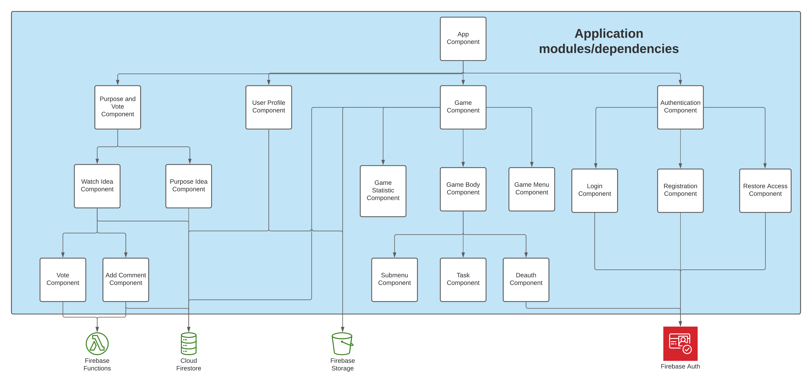
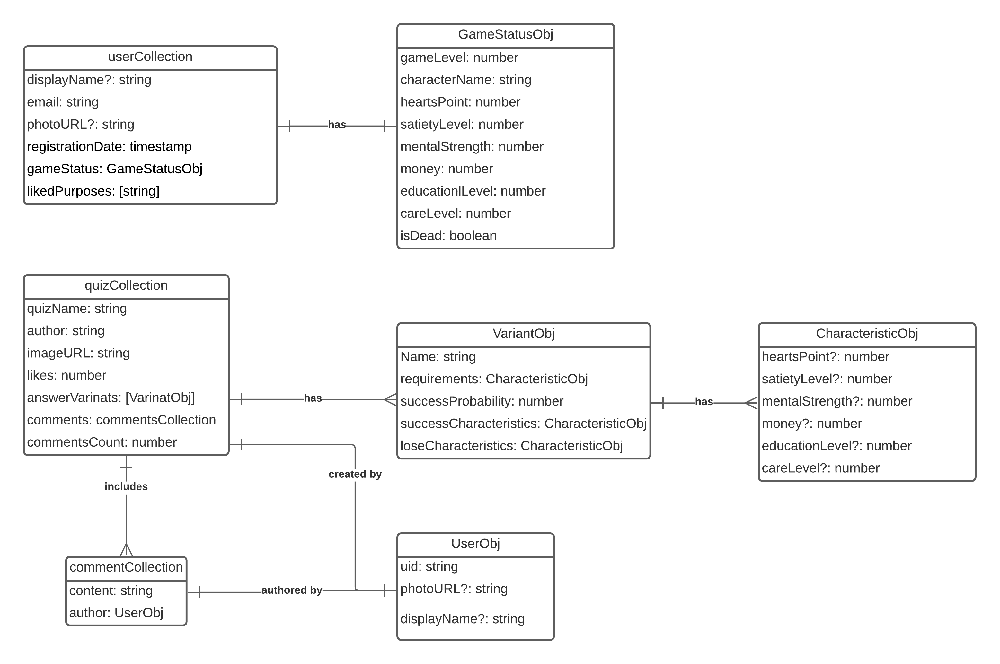

# Application architecture

## Segregation app on modules

## Data and Links between them

## Scenarios

1. Offer of events
   This scenario describes user interactions with the "Event" component and is divided into 2 sub-scenarios: - Adding new events to the vote - View all existing events with the ability to comment and vote them
2. Game components
   This scenario describes the user's interaction with the game character and is divided: - Game menu - Game store for levelling the character, Game work for the character to earn in-game currency - Game statistics
   For example The scale of health, experience, purity, knowledge, etc.
3. Game mechanics, which includes:
   - Submenu
   - Options for tasks for the player
   - Death of a character, which leads to re-authorization to start a new game
4. Authorization
   This scenario is associated with the registration of new users and the entry of old ones, to continue the game on any device with the preservation of the entire gameplay and is divided: - Registration process - Login process - Password recovery process

1) UserCollection:

   - DisplayName - Modifiable attribute, since it can be changed by the user during the game
   - Email - An immutable attribute, since it is entered only once by the user during registration
   - PhotoURL - Modifiable attribute, since it can be changed by the user during the game
   - RegistrationDate - An immutable attribute, since it is created 1 time during user registration and is a constant until the game is lost
   - GameStatus - An updateable attribute as it may change. When you exit the game, the value is "offline", and when you re-enter, the value is "online"
   - LikedProposes - An updatable attribute that can change its value during the game. Depends on the number of offers of events that our user liked

2. GameStatusObj (aggregated components for UserCollection, since the GameStatus attribute is a GameStatusObj object)

   - GameLevel - An updatable attribute, as it is updated during the game and depends on the character's achievements
   - CharecterName - An immutable attribute, since it is entered by the user at the beginning of the game and cannot be further changed
   - HeartsPoint - An updatable attribute, as it is updated by the game based on user actions over the player

## Instructions for adding quizzes

The game contains the mechanics of adding new quizzes from users. To do this, go to the appropriate tab in the game, where you can add, remove, view, vote for the desired quiz:

1. Adding
   To add a new quiz, you need to click on the plus in the upper part of the window and then write the name, description, the necessary characteristics for passing, possible answer options, it is also possible to add an image for the quiz window (otherwise the default image will be used)

2. Remove
   To delete your quiz, just click the image of the "Basket", which is located next to the quiz you created. After which the quiz will be completely deleted without the possibility of recovery

3. View
   By clicking on the "Quiz" tab in the game, the user will see all the quizzes added by him and other users, it is also possible to see how the quiz window will look before it is added to the game, for this, just click on the quiz you need

4. Voting and writing comments
   To add a quiz to the game, the quiz must collect the number of likes set by the administrator, after which it will be added to the game. To see the entire list of comments, just click on the "Messages" image on the side, after which a window with all the comments will open, and in this window you can also write your comment, indicating the reason why the quiz is bad or, on the contrary, good
